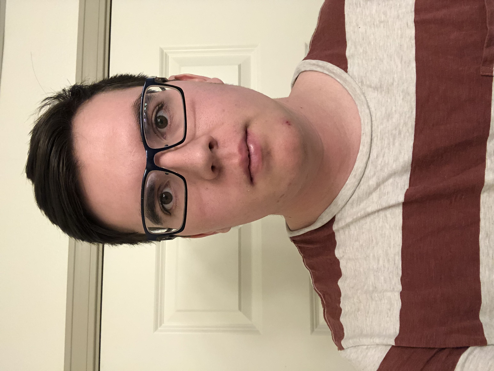
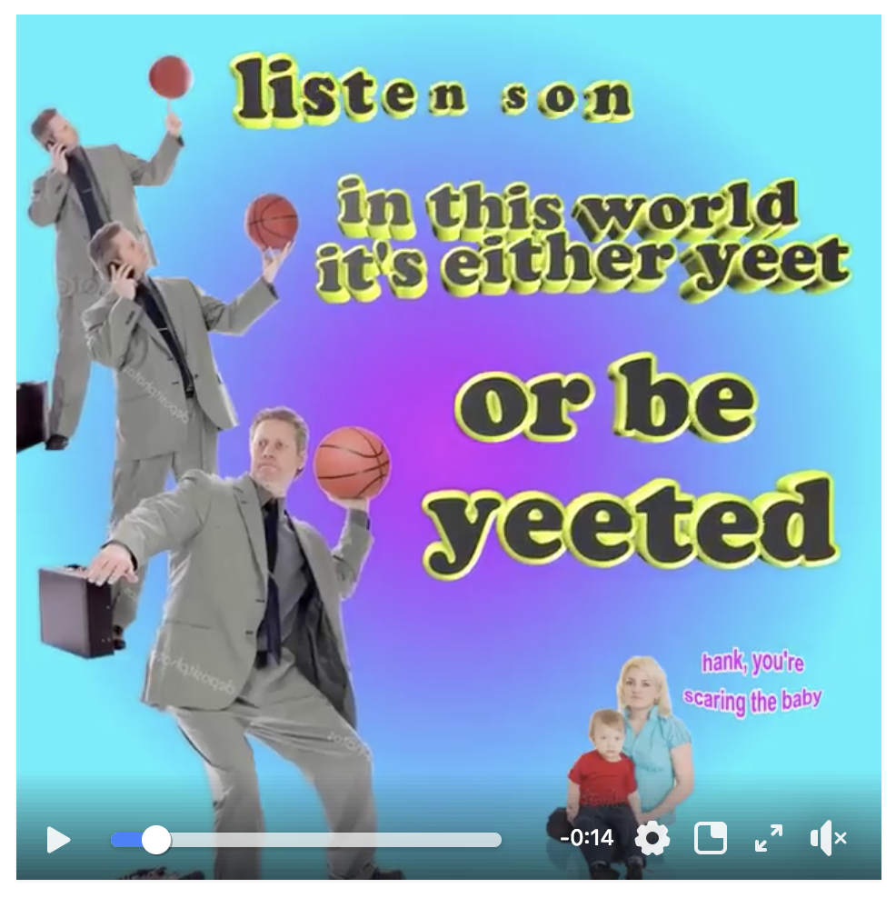

# BLUE TEAM

- Add team photo here
- Add team's main goal for this course

##Individual Sections

******
####Matthew Lawson


- By analyzing data, I would like to know how stoplights cycles could be improved to diminish traffic.

- Six months after graduation, I would like to be traveling around the world. I am planning on graduating December 2020, so maybe somewhere in Europe or Asia. 5 years after that, I plan to be working as a data scientist somewhere. I don't really know or care where at this point, but I think it would be cool to work in a different country (especially Germany) for a while.

- During my carreer, I hope to be able to have a significant positive impact on the environment. Hopefully I can do this with data science. In this course, I am hoping to learn how to use different tools that will allow me to analyzie many different types of data and draw corret conclusions about said data.

- Also, I like to snowboard, hike, swim, and, as of recently, play poker.

******
#### Brandon Bowen


- I'm interested in the growing popularity of profesional gaming. Even now some profesional gamers are making the same amount as profesional sports player. How will this trend contiune? Will it eventualy become a world wide "sport?"

- Six months after graduation, I would at least want a stable job that I can work at for a couple of years before pursuing higher education. After 5 years if I already finished my higher education I would like to work in a foreign country such as Japan. Reason being i'm interested in the country of Japan itself and i'm also learning Japanese.

- What I would want for my greatest career acomplishment to be is to be as successful as I can. In all honestly I don't know what my career holds for me therefore I can only strive to do the best I can in my field of work.

- With these goals in mind, what I plan to take away from this course is R programing, interpreting data and finding conclusions for said data and combing all these skills to effictley gather, transform and communicate my data and work.

- Something about me is I love to read on my off time with no specific genre in mind. Also i'm a competive gamer, while not profesional I do participate in a couple online tournaments and even in person tournaments.

******
This is the first change to the file

```{r}

````