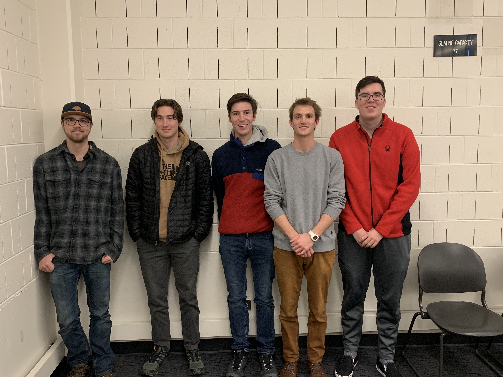

---
output:
  html_document: default
  pdf_document: default
---
# BLUE TEAM

- Our main goal for this course is to learn a lot of Data Science tools and become fluent in R Markdown.

##Individual Sections

******
####Matthew Lawson

- By analyzing data, I would like to know how stoplights cycles could be improved to diminish traffic.

- Six months after graduation, I would like to be traveling around the world. I am planning on graduating December 2020, so maybe somewhere in Europe or Asia. 5 years after that, I plan to be working as a data scientist somewhere. I don't really know or care where at this point, but I think it would be cool to work in a different country (especially Germany) for a while.

- During my carreer, I hope to be able to have a significant positive impact on the environment. Hopefully I can do this with data science. In this course, I am hoping to learn how to use different tools that will allow me to analyzie many different types of data and draw corret conclusions about said data.

- Also, I like to snowboard, hike, swim, and, as of recently, play poker.

    + (comments from Brandon).  Your answers are structured nicely with the bullet list. All your answers have explainations which is appreciated and allows a further insight to why you are currentlly doing what you're doing. 

******
#### Brandon Bowen

- I'm interested in the growing popularity of profesional gaming. Even now some profesional gamers are making the same amount as profesional sports player. How will this trend contiune? Will it eventualy become a world wide "sport?"

- Six months after graduation, I would at least want a stable job that I can work at for a couple of years before pursuing higher education such as getting my masters or PhD if I need it. After 5 years if I already finished my higher education I would like to work in a foreign country such as Japan. Reason being i'm interested in the country of Japan itself and i'm also learning Japanese.

- What I would want for my greatest career acomplishment to be is to be as successful as I can. In all honestly I don't know what my career holds for me therefore I can only strive to do the best I can in my field of work.

- With these goals in mind, what I plan to take away from this course is R programing, interpreting data and finding conclusions for said data and combing all these skills to effictley gather, transform and communicate my data and work.

- Something about me is I love to read on my off time with no specific genre in mind. Also i'm a competive gamer, while not profesional I do participate in a couple online tournaments and even in person tournaments.

    + (Matt) I never knew that professional gamers could make so much money. You should be a little more speciffic about what kind of higher education you are expecting to pursue.

******
#### Bing Mitchell

- I want to be able to find insights about the game of Basketball by analyzing data.

- 6 Months after graduation, I would love to be travelling the world because I love to be in new places. 5 years after graduation, I would like to be a data analyst for a proffesional sports franchise

- I am hoping to be able to learn how to analyze data better, figure out what is relevant and what isn't, and be able to put together nice statistical reports

- I am from Piedmont, California which is right next to Oakland. I am a Golden State Warriors fan and follow the NBA very closely.

    + (comments from Brandon). Your answers are nicely structured with the bullten points. Your code " <<<<<<<< HEAD" messes with your picture which you should fix.

    + (Matt) It's cool that you want to travel after graduation. I do too. I'm interested in what types of insights about Basketball you are hoping to find.

*****

#### Nicolas Zimmerman 

- I would like to see the rate that diseases have been growing in populations that are heavy with anti-vaxers.

- 5 months after graduation I would like to be in some kind of software developement job, 5 years after I would like to be working for a very good company or my own startup.

- Greatest career accomplishments might have to be becoming a systems administrator.

- This course will help because big data and data science are only going to become a bigger deal, and having knowledge of it will be benificial in any field of computer science.

- I was born and raised here in colorado, and I dont think I'll ever want to live in a place without mountains.

    + (Matt) Your question about anti-vaxers is really interesting to me too. You should add a photo to your section.
    
    + (comments from Brandon).  Your answers are nicely structured and are easy to understand. For your first answer you could include a reason why you're intersted in that topic. do you want to help anti-vaxers or some other reason would be helpful for your answer.

## Ryan Tate

- 6 months after graduating I want to find a job as a data scientist.

- 5 years after graduating I want to be working remotely and traveling.

- I hope my greatest career accomplishment will be being able to live in a van.

- I am hoping to learn what it means to be a data scientist.

    + (comments from Brandon). Your answers  are nicely structured and straight to the point which makes it easy to understand. Although it could be better to include a little more detail in your answers. Also you forgot to include the answer to the first question which was " a question you would like to answer ( not statistical related) with data science."

    + (Matt) I's cool that you want to travel and work remotely. I want to do that too! You should include where you want to travel.