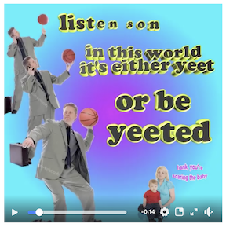

# BLUE TEAM

- Add team photo here
- Add team's main goal for this course

##Individual Sections

******
####Matthew Lawson


- By analyzing data, I would like to know how stoplights cycles could be improved to diminish traffic.

- Six months after graduation, I would like to be traveling around the world. I am planning on graduating December 2020, so maybe somewhere in Europe or Asia. 5 years after that, I plan to be working as a data scientist somewhere. I don't really know or care where at this point, but I think it would be cool to work in a different country (especially Germany) for a while.

- During my carreer, I hope to be able to have a significant positive impact on the environment. Hopefully I can do this with data science. In this course, I am hoping to learn how to use different tools that will allow me to analyzie many different types of data and draw corret conclusions about said data.

- Also, I like to snowboard, hike, swim, and, as of recently, play poker.

******


This is the first change to the file

```{r}

````